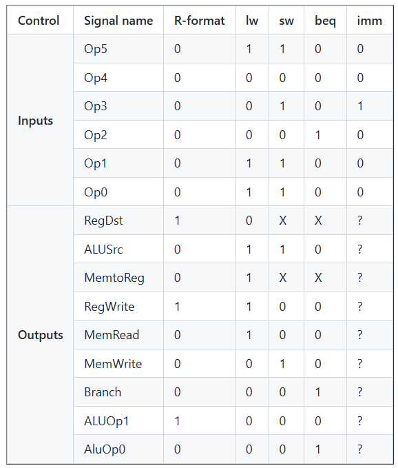

Lab 4 Datapath Control Units
email: nnava026@ucr.edu

Testbench Explanations:

All test benches are based on the tables below. I had to make changes often to the testbench as well as to the code because I realized some of my bit values were wrong and I guess I was getting confused with all the 1's and 0's so I lost track of which ones are supposed to be 1's and which 0's. Then at some point I had I forgot to put a d for spelling reg_dst and that was causing me to fail tests but I fixed it.

Table 1:

Table 2:

Tables 3:

Section 1 tests the control unit.

Section 2 tests the alu control unit.

1.1: R-format
    Tests for accurate signal outputs for the R-format instruction. R-format has an opcode of 000000 and the outputs should match those as shown in its respective column in table 1.

1.2: LW (Load Word)
    Tests for accurate signal outputs for the LW instruction. LW has an opcode of 100011 and the outputs should match those as shown in its respective column in table 1.

1.3: SW (Store Word)
    Tests for accurate signal outputs for the SW instruction. R-format has an opcode of 101011 and the outputs should match those as shown in its respective column in table 1.

1.4: BEQ (Branch if Equal)
    Tests for accurate signal outputs for the BEQ instruction. R-format has an opcode of 000100 and the outputs should match those as shown in its respective column in table 1.

1.5: IMM (immediate)
    Tests for accurate signal outputs for the IMM instruction. This refers to doing R-format instructions but using the immediate. IMM has an opcode of 001000 and the outputs should match those as shown for the R-format in the table, with the only difference in the ALUSrc as 1 instead of 0.

2.1: R-type add
    Tests for the inputs of the R-type opcode from table 1, the function field bits from table 2, 100000, for the add function with expectation of an ALU select input 0010.

2.2: R-type subtract
    Tests for the inputs of the R-type opcode from table 1, the function field bits from table 2, 100010, for the subtract function with expectation of an ALU select input 0110.

2.3: R-type AND
    Tests for the inputs of the R-type opcode from table 1, the function field bits from table 2, 100100, for the AND function with expectation of an ALU select input 0000.

2.4: R-type OR
    Tests for the inputs of the R-type opcode from table 1, the function field bits from table 2, 100101, for the OR function with expectation of an ALU select input 0001.

2.5: R-type NOR
    Tests for the inputs of the R-type opcode from table 1, the function field bits from table 2, 100111, for the NOR function with expectation of an ALU select input 1100.

2.6: R-type Set on less than
    Tests for the inputs of the R-type opcode from table 1, the function field bits from table 2, 101010, for the Set on less than function with expectation of an ALU select input 0111.

2.7: LW (Load Word)
    Tests for the inputs of the LW opcode from table 1, the function field bits from table 2, XXXXXX, for the LW with expectation of an ALU select input 0010.

2.8: SW (Store Word)
    Tests for the inputs of the SW opcode from table 1, the function field bits from table 2, XXXXXX, for the add function with expectation of an ALU select input 0010.

2.9: BEQ (Branch Equal)
    Tests for the inputs of the BEQ opcode from table 1, the function field bits from table 2, XXXXXX, for the add function with expectation of an ALU select input 0110.

2.10: IMM add
    Tests for the inputs of the IMM opcode 001000, the function field bits from table 2, 100000, for the add function with expectation of an ALU select input 0010.

2.11: IMM subtract
    Tests for the inputs of the IMM opcode 001000, the function field bits from table 2, 100010, for the subtract function with expectation of an ALU select input 0110.

2.12: IMM AND
    Tests for the inputs of the IMM opcode 001000, the function field bits from table 2, 100100, for the AND function with expectation of an ALU select input 0000.

2.4: IMM OR
    Tests for the inputs of the IMM opcode 001000, the function field bits from table 2, 100101, for the OR function with expectation of an ALU select input 0001.

2.5: IMM NOR
    Tests for the inputs of the IMM opcode 001000, the function field bits from table 2, 100111, for the NOR function with expectation of an ALU select input 1100.

2.15: IMM Set on less than
    Tests for the inputs of the IMM opcode 001000, the function field bits from table 2, 101010, for the Set on less than function with expectation of an ALU select input 0111.

Waveform:

Case Study Data:

